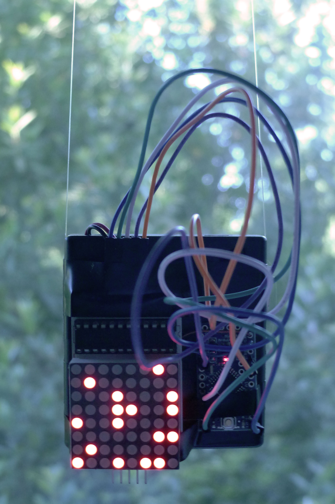
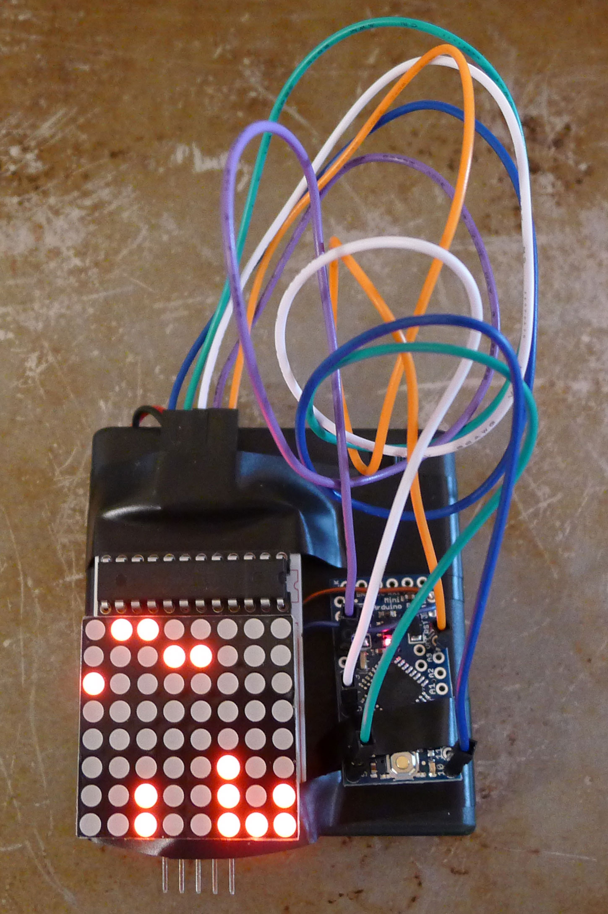

# Suspended Animation

An implementation of Conway's Game of Life for Arduino and an [8x8 LED
Matrix](https://www.sparkfun.com/products/11861).

The final product is a self-contained unit, which runs without any connection to
the outside world. It uses an Arduino Pro Mini, the LED matrix, and a battery pack.

## Resources

* my Life implementation is a port of this [Processsing implementation](https://www.processing.org/examples/gameoflife.html)
* I'm using the product's [sample code](http://linksprite.com/wiki/index.php5?title=LED_Matrix_Kit#pcDuino_Sample_Code) to interface with the LED Matrix
